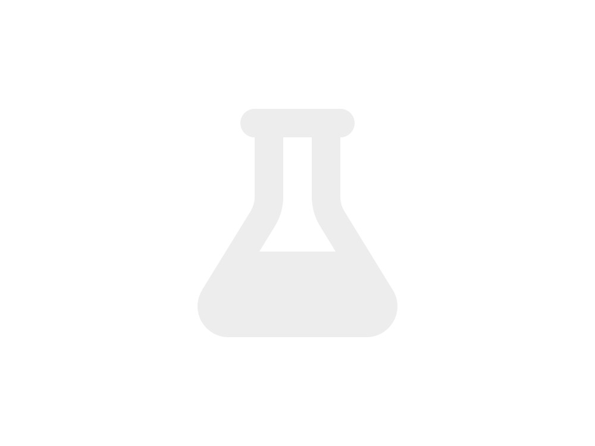



# Welcome to the PRIMAL Lab


[mission statement] Lorem ipsum dolor sit amet, consectetur adipiscing elit, sed do eiusmod tempor incididunt ut labore et dolore magna aliqua.


{{ text }}

<!-- Sideways scrolling photos (structure only; style later) -->

  

    
    
    
    
    
    
    
    
  

---




Lorem ipsum dolor sit amet, consectetur adipiscing elit, sed do eiusmod tempor incididunt ut labore et dolore magna aliqua.






---




Our lab is built on collaboration, curiosity, and mentorship. We are a diverse group of researchers and students working together to advance applied AI and autonomous learning systems, fostering an environment where rigorous research meets creative exploration.






---



## News

<!-- Structure-first: replace with a loop later if your site has posts -->
- News item placeholder 1
- News item placeholder 2 



---



## Sponsors

Our work is made possible by funding from several organizations.

<!-- Placeholder sponsor row -->

  
  
  

